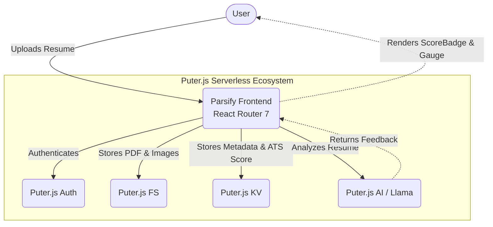

# Parsify

**Know Your Worth. Track Your Progress. Get Hired.**

Parsify is a cutting-edge, real-time resume analyzer and ATS scoring platform designed to help candidates optimize their resumes and track their applications. Built with modern web technologies and a sleek, premium dark-mode aesthetic, Parsify gives you the feedback you need to stay ahead.

---

## Features

- **AI-Powered ATS Scoring:** Get immediate, intelligent feedback on your resume's content, structure, and formatting.
- **Serverless Architecture:** Fully powered by [Puter.js](https://puter.com/) for authentication, key-value storage, and file hosting. No backend required!
- **Premium Dark-Mode UI:** A gorgeous, forced dark-mode interface featuring diagonal grid backgrounds, radial gradients, and fluid animations.
- **Beautiful Typography:** Powered by **Geist** and **Geist Mono** fonts for that crisp, modern developer aesthetic.
- **Blazing Fast:** Built on top of **React Router 7**, **Vite**, and **Tailwind CSS V4**.

---

## Architecture



---

## Tech Stack

- **Framework:** React Router 7 (Vite)
- **Styling:** Tailwind CSS V4 + `tw-animate-css`
- **Typography:** Geist & Geist Mono (Google Fonts)
- **Backend/BaaS:** Puter.js (Auth, KV, FS, AI)
- **Icons/Assets:** Custom SVG Icons & Tabler Icons

---

## Getting Started

### 1. Installation

Clone the repository and install the dependencies:

```bash
npm install
```

### 2. Development

Start the development server with Hot Module Replacement (HMR):

```bash
npm run dev
```

Your application will be available at `http://localhost:5173`.

### 3. Building for Production

Create a production build:

```bash
npm run build
```

Then serve it using the built-in React Router server:

```bash
npm run start
```

---

## UI/UX Highlights

- Custom diagonal line grids and radial gradient overlays to give a deep, immersive background.
- `font-mono` styling applied dynamically to all ATS scores and metrics to emphasize the data.
- Smooth transitions and hover states for all interactive elements.

---
Built and designed for your career success.
